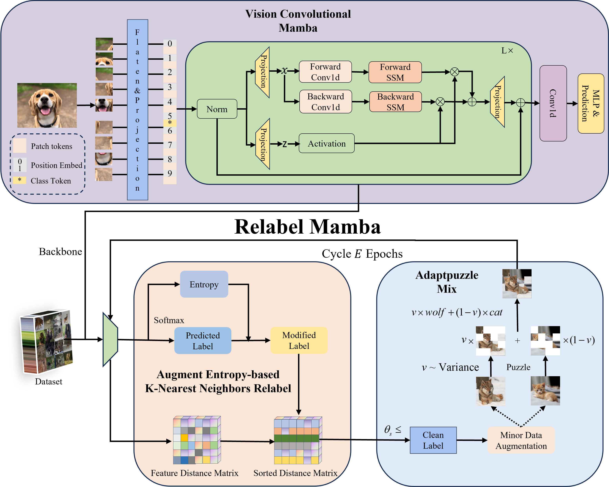

# Learning with noisy labels via Mamba and entropy KNN framework

This repository contains the code and model weights for the **RelabelMamba** architecture, which introduces a Augment Entropy-based K-Nearest Neighbors Relabel (AEKR) method for correcting noisy labels and an Adaptpuzzle data augmentation strategy. This method is built on **Vcm**, which leverages Convolutional Networks (ConvNet) and Vision Transformer (ViT) blocks for feature extraction and processing.

## Table of Contents
- [Installation](#installation)
- [Requirements](#requirements)
- [Model Architecture](#model-architecture)
- [Training & Testing](#training-testing)
- [File Structure](#file-structure)

## Installation

To install the necessary environment for running the code, you can clone the repository and install the required dependencies.

```bash
git clone https://github.com/ningwei-wang/RelabelMamba.git
cd RelabelMamba
```

Install the required Python packages using `pip`:

```bash
pip install -r requirements.txt
```

### Vim Installation

RelabelMamba utilizes **Vim** as a backbone for its architecture. You can install the official Vim repository using:

```bash
git clone https://github.com/hustvl/Vim.git
cd Vim
pip install -e .
```

For more detailed installation instructions, please refer to the official Vim repository [here](https://github.com/hustvl/Vim).

## Requirements

- Python 3.8+
- PyTorch 1.10.0+
- NVIDIA CUDA 11.0+ (if using GPU)
- Other dependencies are listed in `requirements.txt`

## Model Architecture

The RelabelMamba architecture integrates a Vim backbone with several advanced strategies for handling noisy labels. Below is an illustration of the overall architecture:



The key components of the architecture include:
- **Vision Convolutional Mamba**: These blocks are responsible for extracting hierarchical features from the input images. They use depthwise separable convolutions and State Space Model (VSS) blocks for efficient feature extraction.
- **Augment Entropy-based K-Nearest Neighbors Relabel (AEKR)**: This module dynamically corrects noisy labels by computing the entropy variance and applying label correction based on the k-nearest neighbors in the feature space.
- **Adaptpuzzle Data Augmentation**: This module generates mixed examples based on clean and noisy labels to enhance the robustness of the model to label noise.


## Training  Testing

To train the model on your dataset, you can run the following command:

```bash
python cifar 10.py --dataset_path /path/to/cifar 10 \
               --noisy_dataset_path /data/data/noisy \
               --noise_mode sym \
               --noise_ratio 0.3 \
               --k 200 \
               --epochs 50 \
               --lr 0.001 \```

Please ensure that your dataset is properly formatted and placed in the `data/` directory. You can modify the training configuration in the provided YAML files.


## File Structure

The repository is organized as follows:

```
RectMamba/
│
├── utils/                  # Configuration files for training and testing
├── datasets/                     # Directory for datasets
├── mamba-1p1p1/        # mamba tools 
├── vim/        # Vision mamba package and pretrained weights directory
├── models/                   # Directory containing the RectMamba model architecture
├── wandb/                  # Results directory for saving outputs
├── cifar 10.py                  # Script for training & testing the model
├── requirements.txt          # Required Python dependencies
├── README.md                 # Project readme
```

```
